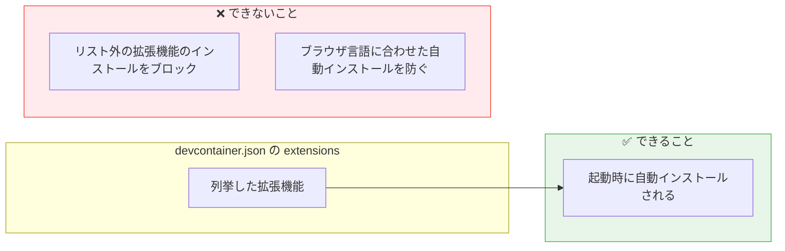

# GitHub Copilot を Dev Containers で使ってみた

製造ビジネステクノロジー部の小林です。

チームへの GitHub Copilot 導入を検討していたとき、次のような点が気になりました。

- コードが外部に漏れないか
- メンバーが野良の MCP サーバーを使い始めたらどうするか
- 誰がいつどこに通信したか把握できるか

これらを本格的に解決するには GitHub Codespaces の組織ポリシーによる権限制限が有効かと思います。その前段として開発環境と Copilot の設定をコードで統一することが第一歩になると考え、まず Dev Containers を試してみました。

## Dev Containers とは

Dev Containers（Development Containers）は、開発環境を Docker コンテナとして定義する仕組みです。リポジトリに `.devcontainer/devcontainer.json` を置くだけで、チーム全員が同じ環境で開発できます。

https://zenn.dev/yamato_snow/articles/fcb3cf8cf0ad03

```
プロジェクト/
└── .devcontainer/
    ├── devcontainer.json   ← 環境定義ファイル
    └── Dockerfile          ← （任意）カスタム環境
```

VS Code の「Dev Containers」拡張と組み合わせて使うのが一般的で、エディタの見た目・操作感はほぼそのままに、実行環境だけをコンテナに閉じ込められます。

### VS Code「Dev Containers」拡張機能

Microsoft 公式の拡張機能（識別子：`ms-vscode-remote.remote-containers`）で、3900 万以上のインストール実績があります。

インストールすると VS Code にリモートエクスプローラーパネルが追加され、起動中のコンテナの詳細をサイドバーから確認できます。

| 項目               | 内容の例                                                          |
| ------------------ | ----------------------------------------------------------------- |
| ワークスペース     | `/Users/kobayashi.shoma/vscodeproject/devcontainer-codespaces`    |
| イメージ           | `mcr.microsoft.com/devcontainers/typescript-node:1-22-bookworm`   |
| 構成ファイル       | `.devcontainer/devcontainer.json` のパス                          |
| バインドマウント   | ローカルのプロジェクトディレクトリ → コンテナ内 `/workspaces/...` |
| ボリュームマウント | VS Code 拡張機能データ用の `vscode` ボリューム                    |

コンテナがどのイメージで動いているか、どのディレクトリをマウントしているかをコマンドなしで把握できるため、環境の確認やトラブルシュートがしやすくなります。

### devcontainer.json に定義できること

- 使用する Docker イメージ（Node.js、Python、Java など）
- 自動インストールする VS Code 拡張機能
- VS Code の設定（フォーマッター、Copilot の設定など）
- コンテナ起動時に実行するコマンド（`npm install` など）
- ポートフォワード設定

## Dev Containers を使うと嬉しいこと

### 開発環境がコードで管理できる

`devcontainer.json` をリポジトリに置くだけで、チーム全員が同じ環境で開発を始められます。「自分の PC では動くのに」という問題が起きにくくなります。

新しいメンバーがジョインしたときも、リポジトリを clone してコンテナを起動するだけでセットアップ完了です。README に「まず Node.js をインストールして…」と書く必要がなくなります。

### OS・マシンの差異を吸収できる

Mac・Windows・Linux が混在するチームでも、コンテナの中は全員同じ Linux 環境です。「Windows だと改行コードが…」「自分だけパスが通らない…」といったトラブルを減らせます。

### AI ツールの設定も統一できる

Copilot の設定（機密ファイルの除外・Agent Mode の挙動など）を `devcontainer.json` に書いておけば、個人の設定に依存せず全員に適用されます。チームで AI ツールを使い始めるときに、最低限の設定を揃えた状態でスタートできます。

## やってみた

### devcontainer.json を作る

```json:devcontainer.json
{
  "name": "Copilot Dev Environment",
  "image": "mcr.microsoft.com/devcontainers/typescript-node:1-22-bookworm",
  "customizations": {
    "vscode": {
      "extensions": [
        "GitHub.copilot",
        "GitHub.copilot-chat",
        "dbaeumer.vscode-eslint",
        "esbenp.prettier-vscode",
        "GitHub.vscode-github-actions"
      ],
      "settings": {
        // Copilot Agent Mode の自動タスク実行を OFF
        "github.copilot.chat.agent.runTasks": false,

        // 拡張機能の自動更新を無効化
        "extensions.autoUpdate": false,

        // 機密ファイルを Copilot から除外
        "github.copilot.enable": {
          "*": true,
          ".env": false,
          "*.pem": false,
          "*.key": false
        }
      }
    }
  },
  // ポートはプライベートのみ（外部公開しない）
  "portsAttributes": {
    "3000": { "visibility": "private" }
  },
  // root ではなく一般ユーザーで実行
  "remoteUser": "node"
}
```

各プロパティの意味はこちらです。

| プロパティ                           | 内容                                                                                                                |
| ------------------------------------ | ------------------------------------------------------------------------------------------------------------------- |
| `name`                               | コンテナの表示名。VS Code のリモートエクスプローラーやステータスバーに表示される                                    |
| `image`                              | 使用する Docker イメージ。Microsoft 公式の Node.js 22 + TypeScript 環境（Debian 12）で、Dockerfile 不要で始められる |
| `customizations.vscode.extensions`   | コンテナ起動時に自動インストールされる拡張機能。Copilot・ESLint・Prettier・GitHub Actions を全員に統一する          |
| `github.copilot.chat.agent.runTasks` | `false` にすることで、Agent Mode のコマンド実行・ファイル操作に人間の承認を必須にする                               |
| `extensions.autoUpdate`              | `false` にすることで、拡張機能の自動更新を止め、意図しないバージョン変更を防ぐ                                      |
| `github.copilot.enable`              | `.env`・`*.pem`・`*.key` など機密ファイルを Copilot の補完対象から除外する                                          |
| `portsAttributes`                    | ポート 3000 を `private` に固定し、開発サーバーが意図せず外部公開されるのを防ぐ                                     |
| `remoteUser`                         | `node`（一般ユーザー）で実行。`root` のままだとコンテナ内で全権限を持つため、最小権限の原則に従う                   |

なお、`extensions` はあくまで「起動時のプリインストールリスト」であり、リスト外の拡張機能の追加インストールを禁止する機能ではありません（後述）。

---

## 実際に試してわかったこと

### 発見 1：`extensions` は「プリインストールリスト」であって「allowlist」ではない

`devcontainer.json` の `extensions` に列挙した拡張機能は、起動時に**自動インストールされる**ものです。ここに書いていない拡張機能のインストールをブロックする機能はありません。

実際に試すと、リストに含まれていない `Vim` 拡張機能も普通にインストールできました。



**ブラウザ言語設定に応じた拡張機能も自動インストールされる**

`devcontainer.json` に含めていないにもかかわらず、ブラウザが日本語設定だったため `Japanese Language Pack` が自動インストールされました。

拡張機能のインストール自体をブロックするには、**VS Code の Extension Management ポリシー（GitHub Enterprise で管理するか、VS Code 自体のポリシー設定）** が必要です。

---

## ローカル VS Code でも使えるのか？

**同じ `devcontainer.json` でローカル VS Code でも開発できます**。

必要なのは 2 つだけです。

- **Docker Desktop**（ローカルでコンテナを動かすため）
- **VS Code 拡張機能「Dev Containers」**（`ms-vscode-remote.remote-containers`）

VS Code でリポジトリを開くと、右下に「コンテナーで再度開く（Reopen in Container）」という通知が出ます。クリックするだけで、Codespaces と全く同じ `devcontainer.json` を使ってローカルの Docker 上にコンテナが立ち上がります。

### ローカルと Codespaces の使い分け

|                | ローカル VS Code          | Codespaces                 |
| -------------- | ------------------------- | -------------------------- |
| 必要なもの     | Docker Desktop + 拡張機能 | ブラウザだけ               |
| 起動速度       | 速い                      | やや遅い（クラウドビルド） |
| オフライン作業 | ✅ できる                 | ❌ できない                |

`devcontainer.json` はローカルでも Codespaces でも共通で使えるため、まずローカルで試してから Codespaces に移行するという進め方もスムーズです。

## まとめ

Dev Containers を試してみて、**開発環境と Copilot の設定をリポジトリで管理できる**のは素直に便利でした。新しいメンバーが clone してコンテナを起動するだけで同じ状態になり、Copilot の設定も個人任せにならずに済みます。

一方で、最初に挙げた懸念（通信の監視・野良 MCP のブロック・証跡監査）は Dev Containers だけでは解決できません。これらは Codespaces の組織ポリシーと組み合わせて初めて実現できる部分です。

次回は Codespaces を使って組織レベルの統制まで踏み込む予定です。

---

## 参考

- [開発コンテナーの概要 - GitHub Docs](https://docs.github.com/ja/codespaces/setting-up-your-project-for-codespaces/adding-a-dev-container-configuration/introduction-to-dev-containers)
- [Dev Containers とは？Docker を使った開発環境構築の決定版【図解で完全理解】 - Zenn](https://zenn.dev/yamato_snow/articles/fcb3cf8cf0ad03)
- [いつでもどこでも VS Code が利用できる GitHub Codespaces - Zenn](https://zenn.dev/yuhei_fujita/articles/github-codespaces-introduction)
- [devcontainer.json リファレンス](https://containers.dev/implementors/json_reference/)
