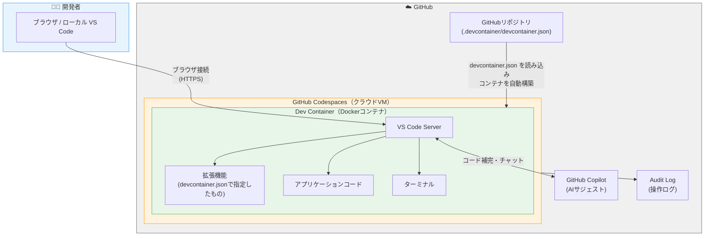
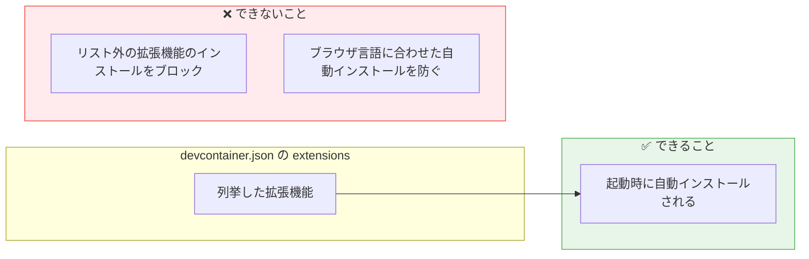
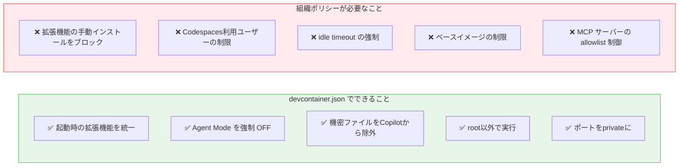

# GitHub Copilot を安全に使うために Dev Containers を Codespaces で動かしてみた

製造ビジネステクノロジー部の小林です。

チームへの GitHub Copilot 導入を検討していたところ、PO から次のような懸念が挙げられました。

- コードが外部に漏れないか
- メンバーが野良の MCP サーバーを使い始めたらどうするか
- 誰がいつどこに通信したか把握できるか

これらをまとめて解決する構成として行き着いたのが **Dev Containers を GitHub Codespaces 上で動かす** というアプローチです。本記事ではその背景・構成・設定内容、そして実際に試してわかったことを共有します。

## Dev Containers とは

Dev Containers（Development Containers）は、開発環境を Docker コンテナとして定義する仕組みです。リポジトリに `.devcontainer/devcontainer.json` を置くだけで、チーム全員が同じ環境で開発できます。

```
プロジェクト/
└── .devcontainer/
    ├── devcontainer.json   ← 環境定義ファイル
    └── Dockerfile          ← （任意）カスタム環境
```

VS Code の「Dev Containers」拡張と組み合わせて使うのが一般的で、エディタの見た目・操作感はほぼそのままに、実行環境だけをコンテナに閉じ込められます。

### devcontainer.json に定義できること

- 使用する Docker イメージ（Node.js、Python、Java など）
- 自動インストールする VS Code 拡張機能
- VS Code の設定（フォーマッター、Copilot の設定など）
- コンテナ起動時に実行するコマンド（`npm install` など）
- ポートフォワード設定

## なぜローカルの Dev Containers だけでは足りないか

Dev Containers はローカルでも十分動きます。ただし、ローカル構成にはセキュリティ統制の面で限界があります。

| 観点                                 | ローカル Dev Containers |
| ------------------------------------ | ----------------------- |
| 環境の統一                           | ✅ できる               |
| ネットワーク通信の制御               | ❌ 各自の PC 依存       |
| 証跡監査（誰がいつどこに通信したか） | ❌ 把握できない         |
| MCP サーバーの接続先制限             | ❌ 難しい               |

特に Copilot Agent Mode や MCP を使い始めると、AI が外部 API を叩く場面が増えます。ローカル開発では「何がどこに通信したか」を管理者が一元的に把握する手段がありません。

## Codespaces に乗せると何が変わるか

GitHub Codespaces は、GitHub が提供するクラウドベースの開発環境です。

https://zenn.dev/yuhei_fujita/articles/github-codespaces-introduction

Dev Containers の設定（devcontainer.json）を使って環境をカスタマイズすることもできます。

```
【ローカル Dev Containers】
手元の PC → VS Code → ローカルの Docker コンテナ

【Codespaces + Dev Containers】
手元の PC → VS Code ──(インターネット)──→ GitHub クラウド上のコンテナ
```

コンテナの中身（`devcontainer.json`）はそのまま使い回せます。変わるのは「**どこで動くか**」だけです。



クラウドで動かすことで、以下のメリットが得られます。

| 観点                    | ローカル | Codespaces |
| ----------------------- | -------- | ---------- |
| 環境の統一              | ✅       | ✅         |
| egress（外部通信）制御  | ❌       | △（後述）  |
| 証跡監査・アラート      | ❌       | ✅         |
| Docker インストール不要 | ❌       | ✅         |
| 低スペック PC でも動く  | ❌       | ✅         |

> **補足：egress 制御について**
> 2026 年 5 月時点で、GitHub Codespaces にはコンテナからの外部通信先を allowlist で制限するネイティブ機能は提供されていません。GitHub Docs にも「現時点ではコードスペースからパブリックインターネットへのアクセスを制限する方法はない（there is no way to restrict codespaces from accessing the public internet）」と明記されています。外部通信の制御が必要な場合は、VPN ゲートウェイの併用や、Azure VNET 統合などの構成を別途検討する必要があります。

## やってみた

### 1. devcontainer.json による環境統制

拡張機能を列挙し、全員に同じものがプリインストールされた状態で開発を始められるようにします。

```json:devcontainer.json
{
  "name": "Secure Copilot Dev Environment",
  "image": "mcr.microsoft.com/devcontainers/typescript-node:1-22-bookworm",
  "customizations": {
    "vscode": {
      "extensions": [
        "GitHub.copilot",
        "GitHub.copilot-chat",
        "dbaeumer.vscode-eslint",
        "esbenp.prettier-vscode",
        "GitHub.vscode-github-actions"
      ],
      "settings": {
        // Copilot Agent Mode の自動タスク実行を OFF
        "github.copilot.chat.agent.runTasks": false,

        // 拡張機能の自動更新を無効化
        "extensions.autoUpdate": false,

        // 機密ファイルを Copilot から除外
        "github.copilot.enable": {
          "*": true,
          ".env": false,
          "*.pem": false,
          "*.key": false
        }
      }
    }
  },
  // ポートはプライベートのみ（外部公開しない）
  "portsAttributes": {
    "3000": { "visibility": "private" }
  },
  // root ではなく一般ユーザーで実行
  "remoteUser": "node"
}
```

`github.copilot.chat.agent.runTasks: false` にすることで、Copilot Agent Mode がファイル編集やコマンド実行を行う際に必ず人間の承認を挟むようにしています。

### 2. Codespaces の組織ポリシー（GitHub Enterprise Cloud / Team）

Codespaces の組織ポリシーでは、以下のような制御が可能です。

**ベースイメージの制限**

Organization 設定で、許可済みの Docker イメージのみから Codespaces を起動できるようにします。野良イメージ経由のマルウェア混入リスクを下げられます。GitHub Team プランでも利用可能です。

**ポートフォワードの公開範囲の制限**

ポートの公開範囲を「Private のみ」に制限するポリシーを設定できます。Public ポートを禁止することで、意図しない外部公開を防ぎます。

**Codespaces ポリシーの主な設定項目**

| 設定項目                 | 推奨値                       | 理由                                           |
| ------------------------ | ---------------------------- | ---------------------------------------------- |
| Maximum idle timeout     | 30 分                        | 放置された Codespaces の乗っ取りリスクを下げる |
| Retention period         | 1〜7 日                      | 侵害されたコンテナが長期間残らないようにする   |
| ベースイメージの制限     | 承認済みイメージのみ         | 未承認のイメージを使わせない                   |
| ポートフォワードの可視性 | Private のみ                 | 外部公開を防ぐ                                 |
| 利用許可                 | 特定リポジトリ・ユーザーのみ | 必要な人だけに絞る                             |

> **注意：egress 制御（外部通信制限）について**
> 本記事の初稿では「Codespaces の outbound network policy でコンテナからの通信先を allowlist で制限できる」と記載していましたが、2026 年 5 月時点で Codespaces にそのようなネイティブ機能は存在しません。GitHub Docs によれば、Codespaces からのパブリックインターネットへの接続を制限する手段は現時点では提供されていません。外部通信の制御が必要な場合は VPN や Azure VNET 統合の利用を検討してください。

### 3. リポジトリ側の保護設定

Codespaces 外の保護線として、リポジトリ側にも設定を入れます。

- **Branch protection**: main への直 push 禁止、PR + レビュー必須
- **CODEOWNERS**: 重要ディレクトリに必須レビュアーを設定
- **Required status checks**: CodeQL・secret scanning push protection・Dependabot を必須化
- **Signed commits**: GPG 署名を必須化
- **GitHub Actions の OIDC 化**: 長期有効なシークレットの代わりに使い捨てトークンを使用

### 4. Copilot の組織ポリシー

| 設定                        | 内容                                                   |
| --------------------------- | ------------------------------------------------------ |
| Public code matching filter | Block を組織で強制（ライセンス汚染を防ぐ）             |
| 対象モデル                  | 組織が承認したモデルのみに限定                         |
| Content exclusions          | `*.env`, `secrets/`, `keys/` を Copilot の参照から除外 |
| Audit log                   | SIEM に転送してプロンプト監査                          |

### 5. MCP サーバーのホワイトリスト管理

Copilot で利用できる MCP サーバーを、承認済みのものだけに限定します。GitHub では MCP レジストリと allowlist ポリシー（「Registry only」モード）を組み合わせることで、レジストリに登録されていない MCP サーバーの利用をランタイムでブロックできます。この機能は Copilot Business / Enterprise で利用可能で、VS Code Stable での enforcement にも対応済みです（Public Preview）。

Enterprise または Organization の Copilot ポリシー画面から MCP レジストリ URL を設定し、「Restrict MCP access to registry servers」を有効にすることで、メンバーが野良 MCP を使うことを防止できます。

---

## 実際に試してわかったこと

### 発見 1：`extensions` は「プリインストールリスト」であって「allowlist」ではない

`devcontainer.json` の `extensions` に列挙した拡張機能は、起動時に**自動インストールされる**ものです。ここに書いていない拡張機能のインストールをブロックする機能はありません。

実際に試すと、リストに含まれていない `Vim` 拡張機能も普通にインストールできました。



**ブラウザ言語設定に応じた拡張機能も自動インストールされる**

`devcontainer.json` に含めていないにもかかわらず、ブラウザが日本語設定だったため `Japanese Language Pack` が自動インストールされました。

拡張機能のインストール自体をブロックするには、**VS Code の Extension Management ポリシー（GitHub Enterprise で管理するか、VS Code 自体のポリシー設定）** が必要です。

### 発見 2：devcontainer.json と組織ポリシーは役割が異なる



`devcontainer.json` はあくまで「環境の初期状態を揃える」ためのものです。セキュリティ統制の観点では、組織ポリシーと組み合わせることで初めて実効性が出ます。

---

## ローカル VS Code でも使えるのか？

**同じ `devcontainer.json` でローカル VS Code でも開発できます**。

必要なのは 2 つだけです。

- **Docker Desktop**（ローカルでコンテナを動かすため）
- **VS Code 拡張機能「Dev Containers」**（`ms-vscode-remote.remote-containers`）

VS Code でリポジトリを開くと、右下に「コンテナーで再度開く（Reopen in Container）」という通知が出ます。クリックするだけで、Codespaces と全く同じ `devcontainer.json` を使ってローカルの Docker 上にコンテナが立ち上がります。

### ローカルと Codespaces の使い分け

|                    | ローカル VS Code          | Codespaces                 |
| ------------------ | ------------------------- | -------------------------- |
| 必要なもの         | Docker Desktop + 拡張機能 | ブラウザだけ               |
| 起動速度           | 速い                      | やや遅い（クラウドビルド） |
| オフライン作業     | ✅ できる                 | ❌ できない                |
| 組織ポリシーの適用 | ❌                        | ✅                         |
| 証跡監査           | ❌                        | ✅                         |

ローカルで動かす場合、Codespaces の組織ポリシー（ベースイメージ制限・ポートフォワード制限・idle timeout など）や監査ログは**効きません**。`devcontainer.json` による環境統一はできても、組織レベルの統制は Codespaces でないと実現できません。

「開発の快適さはローカルで、セキュリティ統制が必要な場面は Codespaces で」という使い分けも現実的な選択肢です。

なお、`devcontainer.json` はローカルでも Codespaces でも共通で使えるため、まずローカルで構築してから Codespaces に移行するという進め方もスムーズです。

## まとめ

Dev Containers を Codespaces で動かすことで得られたのは、主に以下の 2 点です。

1. **セキュリティ制御の一元化** — ベースイメージ制限・ポートフォワード制御・MCP の allowlist 管理・証跡監査をすべて GitHub 側で管理できる
2. **環境差異の解消** — Mac/Windows 混在チームでも全員が同じコンテナで開発できる

Copilot や MCP を使い始めると、AI が外部と通信する機会は確実に増えます。「何がどこに通信しているか把握できる状態」を最初から作っておくのは、チーム全体の安心につながると感じました。

ただし、Codespaces 単体では外部通信先の allowlist 制御（egress 制御）はできない点には注意が必要です。通信先の制限まで求める場合は、VPN や Azure VNET 統合など追加の構成が必要になります。

---

## 参考

- [GitHub Codespaces とは - GitHub Docs](https://docs.github.com/ja/codespaces/about-codespaces/what-are-codespaces)
- [開発コンテナーの概要 - GitHub Docs](https://docs.github.com/ja/codespaces/setting-up-your-project-for-codespaces/adding-a-dev-container-configuration/introduction-to-dev-containers)
- [Dev Containers とは？Docker を使った開発環境構築の決定版【図解で完全理解】 - Zenn](https://zenn.dev/yamato_snow/articles/fcb3cf8cf0ad03)
- [いつでもどこでも VS Code が利用できる GitHub Codespaces - Zenn](https://zenn.dev/yuhei_fujita/articles/github-codespaces-introduction)
- [devcontainer.json リファレンス](https://containers.dev/implementors/json_reference/)
- [GitHub Copilot ポリシー設定](https://docs.github.com/ja/copilot/managing-copilot/managing-github-copilot-in-your-organization)
- [Restricting the base image for codespaces - GitHub Docs](https://docs.github.com/en/codespaces/managing-codespaces-for-your-organization/restricting-the-base-image-for-codespaces)
- [Connecting to a private network - GitHub Docs](https://docs.github.com/en/codespaces/developing-in-a-codespace/connecting-to-a-private-network)
- [Security in GitHub Codespaces - GitHub Docs](https://docs.github.com/en/codespaces/reference/security-in-github-codespaces)
- [MCP server usage in your company - GitHub Docs](https://docs.github.com/en/copilot/concepts/mcp-management)
- [Configure MCP server access - GitHub Docs](https://docs.github.com/en/copilot/how-tos/administer-copilot/manage-mcp-usage/configure-mcp-server-access)
