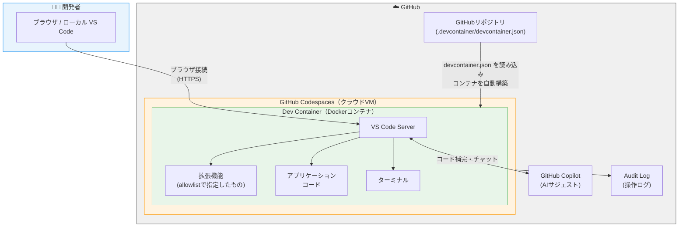
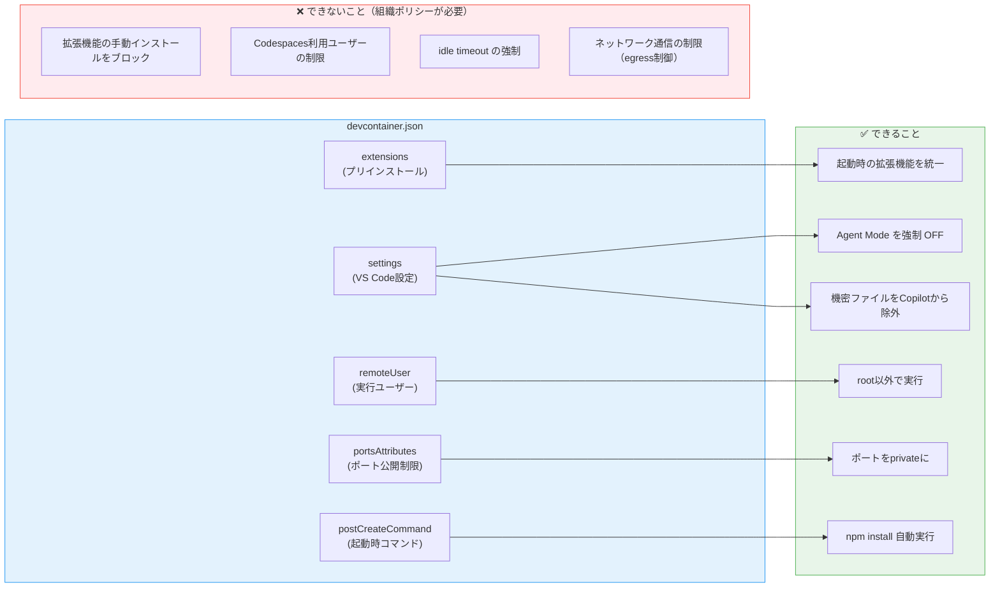
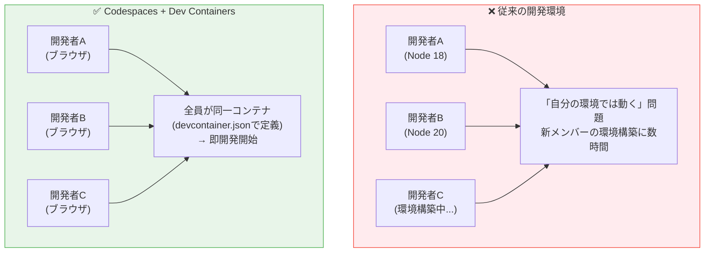

# 構成図

## 図1: Codespaces + Dev Containers の全体像

```mermaid
graph TB
    subgraph Developer["👨‍💻 開発者"]
        Browser["ブラウザ / ローカル VS Code"]
    end

    subgraph GitHub["☁️ GitHub"]
        Repo["GitHubリポジトリ\n(.devcontainer/devcontainer.json)"]

        subgraph Codespaces["GitHub Codespaces（クラウドVM）"]
            subgraph Container["Dev Container（Dockerコンテナ）"]
                VSCode["VS Code Server"]
                Extensions["拡張機能\n(allowlistで指定したもの)"]
                App["アプリケーション\nコード"]
                Terminal["ターミナル"]
            end
        end

        Copilot["GitHub Copilot\n(AIサジェスト)"]
        AuditLog["Audit Log\n(操作ログ)"]
    end

    Browser -->|"ブラウザ接続\n(HTTPS)"| VSCode
    Repo -->|"devcontainer.json を読み込み\nコンテナを自動構築"| Container
    VSCode --> Extensions
    VSCode --> App
    VSCode --> Terminal
    VSCode <-->|"コード補完・チャット"| Copilot
    Codespaces -->|"操作を記録"| AuditLog

    style Developer fill:#e8f4fd,stroke:#2196F3
    style GitHub fill:#f0f0f0,stroke:#666
    style Codespaces fill:#fff3e0,stroke:#FF9800
    style Container fill:#e8f5e9,stroke:#4CAF50
```

---

## 図2: devcontainer.json で制御できること・できないこと

```mermaid
graph LR
    subgraph json["devcontainer.json"]
        E["extensions\n(プリインストール)"]
        S["settings\n(VS Code設定)"]
        U["remoteUser\n(実行ユーザー)"]
        P["portsAttributes\n(ポート公開制限)"]
        C["postCreateCommand\n(起動時コマンド)"]
    end

    subgraph can["✅ できること"]
        C1["起動時の拡張機能を統一"]
        C2["Agent Mode を強制 OFF"]
        C3["root以外で実行"]
        C4["ポートをprivateに"]
        C5["npm install 自動実行"]
        C6["機密ファイルをCopilotから除外"]
    end

    subgraph cannot["❌ できないこと（組織ポリシーが必要）"]
        X1["拡張機能の手動インストールをブロック"]
        X2["Codespaces利用ユーザーの制限"]
        X3["idle timeout の強制"]
        X4["ネットワーク通信の制限（egress制御）"]
    end

    E --> C1
    S --> C2
    S --> C6
    U --> C3
    P --> C4
    C --> C5

    style can fill:#e8f5e9,stroke:#4CAF50
    style cannot fill:#ffebee,stroke:#f44336
    style json fill:#e3f2fd,stroke:#2196F3
```

---

## 図3: 従来の開発環境 vs Codespaces + Dev Containers

```mermaid
graph TB
    subgraph old["❌ 従来の開発環境"]
        direction LR
        D1["開発者A\n(Node 18)"]
        D2["開発者B\n(Node 20)"]
        D3["開発者C\n(環境構築中...)"]
        Problem["「自分の環境では動く」問題\n新メンバーの環境構築に数時間"]
        D1 & D2 & D3 --> Problem
    end

    subgraph new["✅ Codespaces + Dev Containers"]
        direction LR
        N1["開発者A\n(ブラウザ)"]
        N2["開発者B\n(ブラウザ)"]
        N3["開発者C\n(ブラウザ)"]
        Container2["全員が同一コンテナ\n(devcontainer.jsonで定義)\n→ 即開発開始"]
        N1 & N2 & N3 --> Container2
    end

    style old fill:#ffebee,stroke:#f44336
    style new fill:#e8f5e9,stroke:#4CAF50
```
